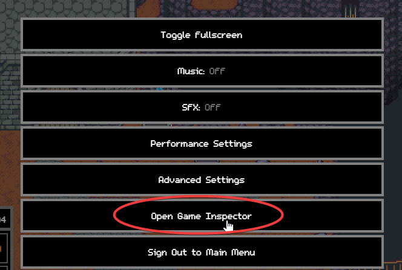
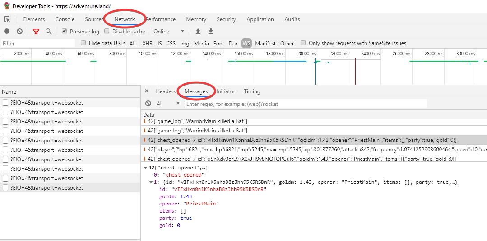

# Overview
Using the chrome debugger, you can view packets sent to & from the server.

## Websocket Traffic
To view the traffic to & from teh server, open the web inspector from the escape menu

Proceed to select "Network", and then "Messages", as circled in the below image

When this page is opened, **relog** your character (or game window). Traffic will then be captured, and can be viewed in the messages list.

